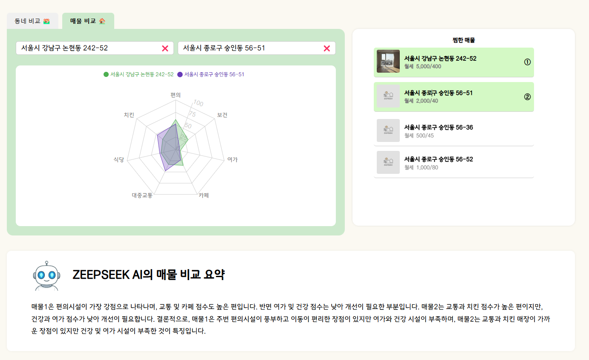

# zeepseek (집 Seek)

- 사회초년생 및 서울 이사가 처음인 모든 사람을 위한 부동산 매물 빅데이터 기반 추천 웹 사이트
- 기간: 2025.02.24 ~ 2025.04.11

---

## 팀원 소개

| **전희성**                               | **백승훈**                | **이진호**                     | **박수민**                       | **하건수**                       | **이원재**                     |
| ---------------------------------------- | ------------------------- | ------------------------------ | -------------------------------- | -------------------------------- | ------------------------------ |
| - 팀장 - 백엔드 개발 - 데이터 처리 | - 백엔드 개발 - 인프라 | - 백엔드 개발 - 데이터 처리 | - 프론트 개발 - 데이터 크롤링 | - 프론트 개발 - 데이터 크롤링 | - 프론트 개발 - 데이터 처리 |

---

## 기술스택

## 기술스택

Frontend
  

Backend
         

DB & Cache
   

Infra & DevOps
        

Collaboration Tools
  

---

## 주요 기능

1. **개인 선호도 맞춤형 매물 추천 기능**  
   사용자의 관심사 및 선호도 분석을 기반으로 맞춤형 매물을 추천합니다.

2. **행정동 및 매물의 빅데이터 기반 비교 및 GPT 요약 설명 기능**  
   광범위한 데이터를 활용하여 각 행정동과 매물의 특성을 비교 분석하며, GPT 기반의 요약 설명을 제공합니다.

3. **협업 필터링 추천 시스템**

   - **액티비티 로그 활용:** 사용자의 행동 데이터를 기반으로 SVD(특이값 분해) 모델을 학습하여 SVD AI 기반 협업 필터링 추천 시스템을 구현하였습니다.
   - **콘텐츠 기반 필터링:** 코사인 유사도를 이용해 사용자와 매물 간의 유사도를 측정, 콘텐츠 특성을 분석하여 맞춤형 매물 추천을 보완합니다.

4. **위치 및 점수 기반 매물 검색 기능**

   - **공간 기반 계산:** BallTree 알고리즘과 DB의 공간 기반 데이터베이스를 활용하여 위도, 경도 정보를 빠르게 처리합니다.
   - **점수 계산:** 지리적 위치와 함께 다양한 데이터를 조합하여 매물 점수를 실시간으로 계산, 사용자가 원하는 위치 기반 매물 검색을 지원합니다.

5. **네이버, 카카오 소셜 로그인**  
   간편한 소셜 로그인 기능을 통해 사용자 인증을 지원합니다.

---

## Branch 별 파일 구조 및 CI/CD 파이프라인 안내

- **각 3개의 backend, frontend, recommend 브랜치** 별로 Jenkins pipeline을 통해 자동 배포 중
- 기능 개발 시 `"feat/기능명"`의 형태로 브랜치를 생성 후 각 기능별 브랜치로 머지하여 배포
- push 이벤트 발생 시 hook

### 1. backend

- 백엔드 서버 배포 용 브랜치
- BE 폴더 내 Spring Boot 어플리케이션

### 2. frontend

- 프론트엔드 서버 배포 용 브랜치
- FE 폴더 내 React 어플리케이션

### 3. recommend

- 추천 기능을 위한 파이썬 서버 배포 용 브랜치
- ML 폴더 내 Fast API 파이썬 어플리케이션

---

## ERD

---

## 시스템 구조

---

## 화면 예시

### 1. 메인 화면

**설명:** 집 SEEK의 메인 페이지로, 버튼 클릭시 해당 집의 형태의 필터링 결과페이지로 바로 넘어갑니다.

---

### 2. 지도 화면

**설명:** 매물 검색 및 매물을 추천받을 수 있는 페이지 이며 지도위에서 매물과 주변의 정보를 얻을 수 있습니다.

---

### 3. 비교 화면

**설명:** 선택한 매물들의 데이터를 비교하여, 데이터 기반 의사결정을 지원하는 화면입니다.

---

### 4. 추천 화면

**설명:** 사용자의 선호도와 데이터 분석을 기반으로 맞춤형 매물 추천 결과를 제공하는 화면입니다.

---

## 링크

- **사이트:** [https://j12e203.p.ssafy.io/](https://j12e203.p.ssafy.io/)
- **특화 프로젝트 공유 노션:** [https://www.notion.so/1ad3e02603998064b5b4e0ffd79cb0b2?pvs=21](https://www.notion.so/1ad3e02603998064b5b4e0ffd79cb0b2?pvs=21)
- **Figma 디자인:** [https://www.figma.com/design/LRVMjnXpOMbfpjHkvVqWkV/%ED%8A%B9%ED%99%94-%ED%94%84%EB%A1%9C%EC%A0%9D%ED%8A%B8-E203(%EC%A7%91%EC%8B%9C%ED%81%AC)?node-id=0-1&t=Y1JF9QsjmRCaGPrI-1](<https://www.figma.com/design/LRVMjnXpOMbfpjHkvVqWkV/%ED%8A%B9%ED%99%94-%ED%94%84%EB%A1%9C%EC%A0%9D%ED%8A%B8-E203(%EC%A7%91%EC%8B%9C%ED%81%AC)?node-id=0-1&t=Y1JF9QsjmRCaGPrI-1>)
