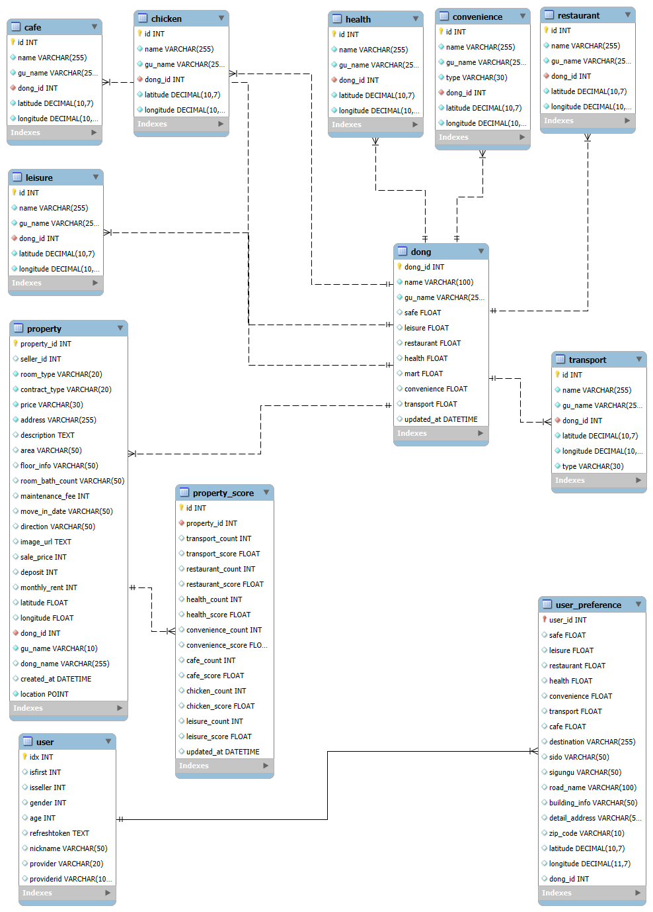

# README.md

# 프로젝트 명: 집seek (zeepseek)

사회초년생 및 서울 이사가 처음인 모든 사람을 위한 부동산 매물 빅데이터 기반 추천  웹 프로젝트

---

## 팀원 소개

| **전희성** | **백승훈** | **이진호** | **박수민** | **하건수** | **이원재** |
| --- | --- | --- | --- | --- | --- |
| - 팀장  - 백엔드 개발  - 데이터 처리 | - 백엔드 개발  - 인프라 | - 백엔드 개발  - 데이터 처리 | - 프론트 개발  - 데이터 크롤링 | - 프론트 개발  - 데이터 크롤링 | - 프론트 개발 - 데이터 처리 |

---

## 기술스택

- frontend

| Redux | React | Javascript ES6 |
| --- | --- | --- |
|  |  |  |

- DB

| MySQL | Elasticsearch | Redis | MongoDB |
| --- | --- | --- | --- |
|  |  |  |  |

- Backend

| Java | Python | Spring Boot | scikit | Spring |
| --- | --- | --- | --- | --- |
|  |  |  |  |  |
| FastAPI | JPA | Gradle | SpringSecurity | OAuth2 |
|  |  |  |  |  |

- infra

| Amazom EC2 | Docker | Docker Compose |
| --- | --- | --- |
|  |  |  |

- Monitoring

| Grafana | Loki |
| --- | --- |
|  |  |

---

## 주요 기능

1. 개인 선호도 맞춤형 매물 추천 기능
2. 행정동 및 매물의 빅데이터 기반 점수를 통한 비교 및 GPT 요약 설명 기능 
3. 액티비티 로그 기반 협업 필터링 기능
4. 지도, 매물 검색, 찜, 매물 및 동네 댓글 기능
5. OAuth 로그인

---

# Branch 별 파일 구조 및 CI/CD 파이프라인 안내

- 각 3개의 backend, frontend, recommend 브랜치 별로 Jenkins pipeline을 통해 자동 배포 중
- 기능 개발 시 “feat/기능명” 의 형태로 브랜치 생성 후 각 기능 별 브랜치로 머지하여 배포
- push 이벤트 발생 시 hook

## 1. backend

- 백엔드 서버 배포 용 브랜치
- BE 폴더 내 Spring Boot 어플리케이션

## 2. frontend

- 프론트엔드 서버 배포 용 브랜치
- FE 폴더 내 React 어플리케이션

## 3. recommend

- 추천 기능을 위한 파이썬 서버 배포 용 브랜치
- ML 폴더 내 Fast api 파이썬 어플리케이션

---

# 링크

## 🌐[https://j12e203.p.ssafy.io/](https://j12e203.p.ssafy.io/)

### 📚 [특화 프로젝트 공유 노션](https://www.notion.so/1ad3e02603998064b5b4e0ffd79cb0b2?pvs=21)

### 🎨 https://www.figma.com/design/LRVMjnXpOMbfpjHkvVqWkV/%ED%8A%B9%ED%99%94-%ED%94%84%EB%A1%9C%EC%A0%9D%ED%8A%B8-E203(%EC%A7%91%EC%8B%9C%ED%81%AC)?node-id=0-1&t=Y1JF9QsjmRCaGPrI-1

---

# ERD

# 시스템 구조

.png)

# 캡쳐

(추후 추가 예정)
